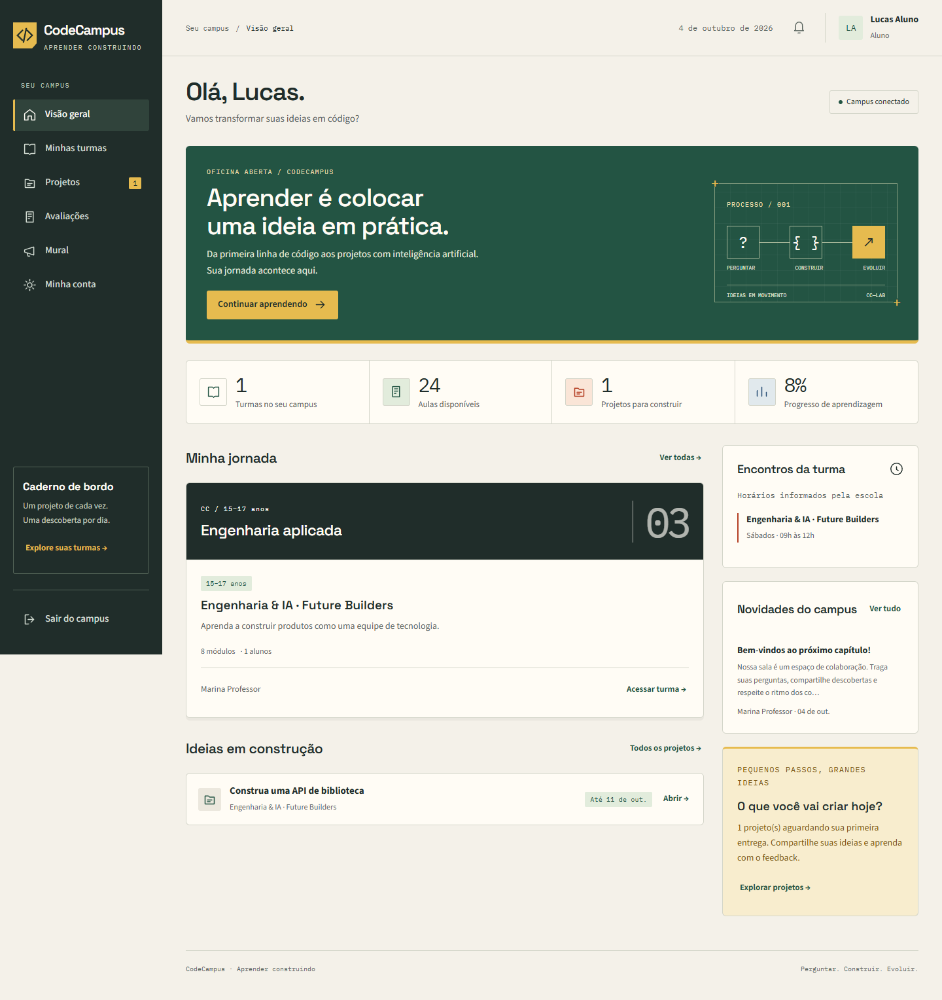

# CodeCampus

Um campus para crianças e adolescentes aprenderem programação construindo projetos. Aplicação full stack com interface em português, API FastAPI, SQLAlchemy, PostgreSQL e armazenamento privado AWS S3. Monorepo, sem depender de serviços pagos para rodar a demonstração local.

Código publicado em [projects/CodeCampus no GitHub de Thiago Alcarás](https://github.com/thiago-alcaras/thiago-alcaras.github.io/tree/main/projects/CodeCampus). A credencial atual não permite criar um repositório separado; esta pasta mantém a estrutura completa e pode ser extraída para um repositório próprio.

```powershell
git clone https://github.com/thiago-alcaras/thiago-alcaras.github.io.git
cd thiago-alcaras.github.io/projects/CodeCampus
```



Guia passo a passo: [integração gratuita/local, PostgreSQL, AWS S3 e publicação de uma aula](docs/tutorial-integracao-gratuita.md). O PDF da aula e o kit de exercícios preparados para o professor permanecem privados, fora do Git.

## Funcionalidades implementadas

- Administração, professores, alunos e responsáveis, com autorização no servidor e isolamento por turma.
- Criação de contas, desativação, alteração de senha, recuperação pela administração e revogação de sessões.
- Turmas, matrículas, vínculos de responsáveis e registro da confirmação de consentimento pela escola.
- Módulos ordenados, aulas com roteiro, links de vídeo, rascunho/publicação, anexos e progresso individual.
- Upload pelo computador: PDF, TXT, CSV, ZIP, imagens, MP4/WebM, DOCX/PPTX. Limite configurável, nomes sanitizados, validação de assinatura e integração ClamAV.
- Projetos com prazo, repositório HTTPS ou arquivo, entregas versionadas, indicação de atraso, rubrica ponderada e feedback do professor.
- Avaliações de múltipla escolha, editor de questões, publicação, uma tentativa por aluno, alternativas e questões embaralhadas, autosave, prazo no servidor e correção automática.
- Tela cheia solicitada e registro de troca de aba, perda de foco, saída de tela cheia, cópia, colagem e atalho de impressão.
- Mural por turma, chamada, relatório de progresso/notas/presença e exportação CSV.
- Certificado privado de curso livre: emissão pela equipe após 100% das aulas e nota mínima 70 nos projetos e provas publicados. Documento imprimível acessível em Minha conta.
- Auditoria de ações administrativas e acadêmicas, sem registrar senhas ou conteúdos dos arquivos.
- Dashboard responsivo, navegação por teclado e estados de erro e carregamento.

## Executar no Windows

Python 3.11+. Na raiz do repositório:

```powershell
python -m venv .venv
.venv/Scripts/python -m pip install -r requirements.txt
.venv/Scripts/python -m apps.api.cli seed-demo
.venv/Scripts/python -m uvicorn apps.api.main:app --host 127.0.0.1 --port 8000
```

Acesse http://127.0.0.1:8000. A demonstração usa SQLite e armazenamento local no diretório **privado e ignorado pelo Git** `data/`. Não execute seed em banco com dados reais.

| Perfil fictício | E-mail | Senha somente da demonstração |
|---|---|---|
| Administração | admin@demo.codecampus.test | Aprender!2026 |
| Professor | teacher@demo.codecampus.test | Aprender!2026 |
| Aluno | student@demo.codecampus.test | Aprender!2026 |
| Responsável | guardian@demo.codecampus.test | Aprender!2026 |

O seed é **explícito**, recusado em produção e nunca ocorre ao iniciar a API. Os usuários e os roteiros são fictícios. O aluno fictício está matriculado apenas na turma final, permitindo verificar o isolamento das outras turmas.

Linux/macOS: substitua `.venv/Scripts/python` por `.venv/bin/python`.

## PostgreSQL e containers

```powershell
Copy-Item .env.example .env
# Edite POSTGRES_PASSWORD no arquivo privado antes de subir.
docker compose up --build -d
docker compose exec app python -m apps.api.cli seed-demo
```

Para um banco real vazio, crie somente a administração:

```powershell
docker compose exec app python -m apps.api.cli create-admin --email admin@sua-escola.com --name "Administração"
```

A senha é solicitada sem eco. A administração cadastra os professores e os alunos, cria as turmas e realiza as matrículas. O professor organiza módulos/aulas, publica projetos e avaliações, recebe entregas e registra o feedback. Responsáveis precisam de vínculo criado pela administração.

Sem Docker, `DATABASE_URL=postgresql+psycopg://...` seleciona PostgreSQL. A versão inicial cria as tabelas em banco vazio. Atualizações futuras de esquema precisam de migrações explícitas; `create_all` não modifica tabelas existentes.

## Uploads privados na AWS

Implementação em `apps/api/storage.py`; infraestrutura CloudFormation em `infra/aws/storage.yaml`. Configuração e procedimento completos em [docs/aws.md](docs/aws.md).

- `STORAGE_BACKEND=s3` e `S3_BUCKET` selecionam S3; não existe fallback silencioso para armazenamento local.
- SDK oficial boto3, cadeia padrão de credenciais, preferindo IAM Task Role em produção e SSO no computador.
- Bucket sem acesso público, ACLs desativadas, criptografia AES256, versionamento e exigência de TLS.
- Arquivos em chaves aleatórias `private/<id>`, sem nomes dos alunos nos caminhos S3.
- Upload é validado e verificado antes de ser enviado ao S3; não há endpoint que torna o conteúdo público.
- Download autorizado pela API, com URL assinada válida por 60 segundos.
- Conteúdos de alunos não aparecem para colegas ou responsáveis; professores da turma têm acesso para avaliação. Materiais do professor ficam disponíveis aos perfis vinculados à turma.

Os recursos AWS **não são criados automaticamente** e não há chaves no repositório. Os testes S3 usam cliente simulado; a operação na sua conta requer provisionamento e teste de integração com suas credenciais.

## Avaliações e segurança

O servidor não envia gabaritos aos alunos. Ele mantém o tempo, a tentativa única, as respostas e a nota. Alterações de questões são bloqueadas após a primeira tentativa; rubricas são preservadas após a primeira entrega. Eventos do navegador são evidências técnicas para revisão humana, **não uma prova automática de fraude**.

Uma aplicação web não consegue impedir screenshots do sistema operacional, fotografias, ferramentas de desenvolvimento ou uso de outro dispositivo. O bloqueio de impressão/cópia é uma barreira de interface e pode ser contornado. Para provas de maior exigência, combine supervisão e dispositivos gerenciados; não ofereça uma garantia de bloqueio total aos alunos.

Sessões opacas com hash armazenado no banco, cookie HttpOnly/SameSite Strict/Secure em produção, CSRF por sessão, validação de origem, scrypt, controle de tentativas de login no banco, CSP e cabeçalhos de proteção. Não há cadastro público. Veja [docs/security.md](docs/security.md) para operação e limites.

## Trilhas pedagógicas

Três percursos de referência: exploradores de 8–11 anos, desenvolvimento de 12–14 e engenharia/IA de 15–17. Faixas são recomendações pedagógicas, não uma verificação automática de idade.

A turma final possui oito módulos, com trabalho em equipe, arquitetura, qualidade/segurança, desenvolvimento assistido por IA, RAG, agentes, cloud/confiabilidade e um projeto integrador. A proposta original é inspirada nos pilares públicos do [MBA em Engenharia de Software com IA da Full Cycle](https://ia.fullcycle.com.br/mba-ia/), adaptada para adolescentes. Não copia aulas, não oferece conteúdo do MBA e não tem vínculo com a Full Cycle.

Plano, critérios e projetos em [docs/curriculum.md](docs/curriculum.md). Os conteúdos reais devem ser produzidos/licenciados pela escola e enviados pelo upload privado.

## Testes

```powershell
.venv/Scripts/python -m pytest -q
.venv/Scripts/python -m compileall -q apps
```

Antes dos testes, instale as dependências de desenvolvimento com `.venv/Scripts/python -m pip install -r requirements-dev.txt`. Os testes cobrem permissões, CSRF, privacidade, uploads, SDK S3, scanner, entregas, avaliação, prazos, auditoria, certificados e recuperação de acesso. Cada caso usa banco isolado com dados fictícios.

Teste real no navegador, contra **um novo banco de demonstração**, pois realiza entregas e encerra uma prova:

```powershell
npm ci
npx playwright install chromium
node tests/e2e.cjs
```

`BASE_URL` muda o servidor; `BROWSER_CHANNEL=msedge` usa Edge instalado. Requer Node 20+. Testa os quatro perfis e larguras 320/390/768/1440. O workflow GitHub Actions está incluído para executar API e navegador em ambientes isolados quando a pasta for a raiz de um repositório. Na publicação dentro do portfólio, ele não é ativado automaticamente: a credencial disponível não tem permissão `workflow`. Docker/PostgreSQL, ClamAV real e AWS precisam de validação no ambiente de destino.

## Estrutura

```text
apps/api/       API, modelos relacionais, segurança, storage e bootstrap
apps/web/       Interface HTML/CSS/JavaScript, servida pela mesma origem
tests/          Testes da API, storage e navegador
infra/aws/      Bucket privado, policy e IAM task role
docs/           Arquitetura, AWS, currículo e operação
```

O frontend usa JavaScript nativo para manter a operação simples e eliminar uma etapa de build. A API é a fonte de verdade para permissões e dados. A mesma imagem serve UI e API, com módulos separados internamente. [Decisões e evolução](docs/architecture.md).

## Estado da entrega

Versão inicial funcional para desenvolvimento e homologação, com os fluxos listados implementados e teste de navegador. A publicação do código no GitHub não hospeda a aplicação dinâmica. Para uso real, configure HTTPS, PostgreSQL com backups, identidade AWS, scanner, política de dados e monitoramento, e valide a infraestrutura de destino. Não há serviço de e-mail, transcodificação de vídeo, pagamentos, SSO/MFA ou executor de código de alunos nesta versão.
