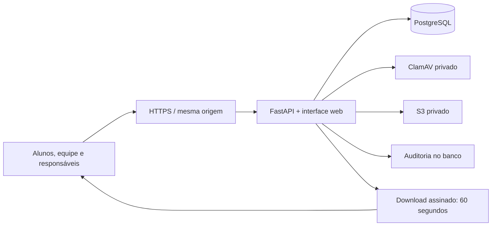

# Arquitetura e decisões

## Monorepo e monólito modular

UI e API compartilham uma origem, diminuindo a superfície de cookies/CORS e permitindo servir a aplicação inteira com uma imagem. Domínios separados: identidade e autorização; turmas e currículo; conteúdo e storage; projetos e feedback; avaliações e integridade; relatórios e auditoria.

Microserviços não são necessários para iniciar. Distribuir o sistema adicionaria consistência eventual, filas, tracing, múltiplos deploys e complexidade sem demanda conhecida. Quando vídeos, notificações e análises tiverem volume, extraia primeiro os trabalhos assíncronos para workers e filas. Autorização e matrícula continuam como fontes de verdade.

## Dados

Users → Sessions; Classrooms → Enrollments; Guardians → GuardianLinks; Classrooms → Modules → Lessons → Progress; Classrooms → Assets; Classrooms → Assignments → Submissions; Classrooms → Exams → Attempts → ExamEvents; Classrooms → Attendance, Announcements e Certificates.

Chaves estrangeiras habilitadas em SQLite, unicidade de matrícula, vínculo, progresso, tentativa e versões de entrega. PostgreSQL usa bloqueio de linha para respostas/finalização; a restrição de tentativa garante idempotência de início. Cada tentativa guarda uma cópia embaralhada das questões e respostas corretas; o gabarito permanece no servidor.

## Fluxo de conteúdo

1. Professor autenticado seleciona turma/aula e arquivo no computador.
2. API verifica perfil, atribuição e limite de upload.
3. Multipart usa arquivo temporário; a aplicação lê em blocos de 1 MB e valida tamanho, formato e assinatura básica.
4. Se configurado, ClamAV verifica o conteúdo antes de persistir; produção exige scanner. Falha ou resultado inconclusivo bloqueia o arquivo.
5. Conteúdo é enviado ao S3 ou armazenamento local privado; banco guarda metadados.
6. Download verifica a autorização vigente. S3 entrega usando URL de 60 segundos; local responde como anexo.

Pasta de upload não é servida pelo StaticFiles e nunca entra no Git. O processo não executa, descompacta ou importa código dos projetos. Uploads grandes passam pela API: 100 MB padrão. Vídeos maiores exigirão multipart direto para uma área de quarentena, confirmação, verificação e transcodificação assíncrona antes da publicação.

## Avaliações

Tempo servidor, snapshot de questões, salvamento de respostas incrementais e finalização idempotente. A leitura de resultados ou retomada também consolida tentativas expiradas. Não há worker necessário para encerrar a nota de uma prova inativa: o prazo permanece fechado, e a consolidação ocorre no próximo acesso.

O navegador solicita fullscreen e envia eventos. O aluno recebe apenas o enunciado e alternativas, sem campo `correct`. Notas automáticas são liberadas ao finalizar. Eventos não alteram notas automaticamente. Questões são objetivas nesta versão; projetos cobrem habilidades práticas e recebem avaliação humana.

## Implantação e evolução

FastAPI/SQLAlchemy permitem PostgreSQL em produção e SQLite em desenvolvimento. O esquema inicial é criado com `create_all`. Mudanças posteriores precisam de migrations versionadas com backup e rollback; não executar alteração destrutiva de tabelas em inicialização.

Provisionar compute (ECS/App Runner/EC2 ou outro provedor), ingress HTTPS, PostgreSQL gerenciado, rede privada do scanner e gerenciamento de segredos de banco. O CloudFormation entregue cobre storage e role, não provisiona compute nem RDS. Configurar limites e rate limit de borda no ingress; testes usam SQLite e não substituem o teste de concorrência em PostgreSQL.

Próximas extensões justificadas por necessidades reais: SSO/MFA de equipe, convite/redefinição por e-mail, calendário com eventos individuais, banco de questões reutilizável, notificações assíncronas, matrículas em massa, cobrança, backup automatizado e execução de código em sandbox isolado. O sistema atual não executa código arbitrário de alunos e não chama provedores de IA; a trilha de IA é conteúdo pedagógico.
